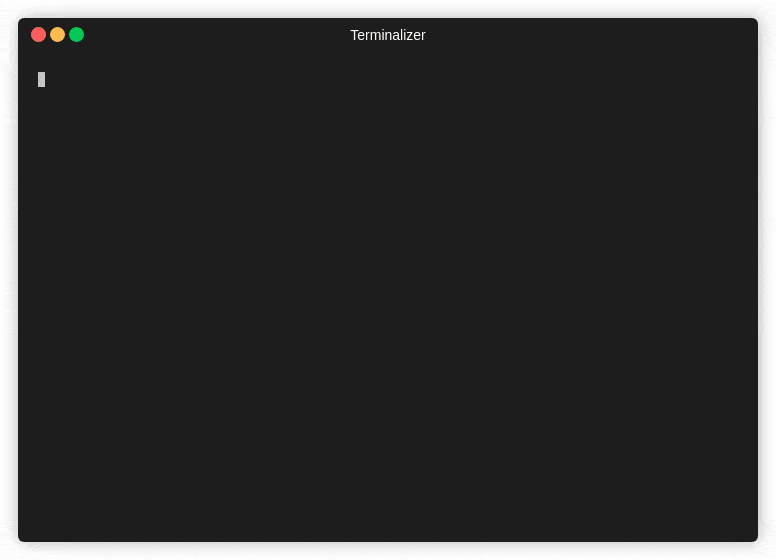

<p align="center">
    
</p>

<h1 align="center">Bilibili 弹幕工具集</h1>

<div align="center">

[![Build status][github-action-build-image]][github-action-build-url] [![coverity status][coverity-image]][coverity-url] [![license][license-image]][license-url] [![love][love-image]][love-url]

[github-action-build-image]: https://github.com/windowsair/bilibili_danmuku/actions/workflows/build-binary.yml/badge.svg
[github-action-build-url]: https://github.com/windowsair/bilibili_danmuku/actions/workflows/build-binary.yml

[coverity-image]: https://img.shields.io/coverity/scan/24860.svg
[coverity-url]: https://scan.coverity.com/projects/windowsair-bilibili_danmaku


[license-image]: https://img.shields.io/badge/license-GPLv3-green.svg
[license-url]: https://github.com/windowsair/corsacOTA/LICENSE

[love-image]: https://img.shields.io/badge/made%20with-%e2%9d%a4-ff69b4.svg
[love-url]: https://github.com/windowsair/bilibili_danmuku


**警告： 该项目暂未准备好用于生产。API、文档、用法的更改恕不另行通知。**

</div>


----


# live_render, 直播弹幕渲染工具

live_render是一个bilibili直播录制工具，能够在录制直播视频的同时渲染弹幕，在直播结束时直接输出压制好弹幕的视频。


## 给我几个用和不用的理由？

在这个小节，我们将向您简要介绍该项目的优势与劣势。

优势

- 📦 开箱即用。只需要ffmpeg即可开始录制。
- 🚀 无需等待。当录播结束时即可直接使用压制好的文件。
- 🎨 支持更多的字体效果。您可以自定义字符集、透明度、描边、阴影、加粗等字体效果，此外支持更多的Unicode字符（取决于您机器内的字符集）。
- ⚙️ 支持自定义编解码器。此外，您可以传递更多的编码器参数，能够获得与录制完毕再压制弹幕类似的压制效果。

劣势

- ⚠️ 对异常处理不够健壮。这里有一小部分是ffmpeg目前存在的问题，但主要是项目目前存在的问题。暂时无法处理断流等问题。
- ⚠️ 弹幕的同步处理机制暂不完善。
- ⚠️ 实时渲染对机器处理能力有一定要求。


## 演示

1. 压力测试


> 测试机器环境： Windows i7-9750H + GTX1650（笔记本平台） 15分钟测试，渲染全屏固定弹幕和滚动弹幕。平均速率约为0.93X。


2. 45%分屏弹幕测试


> 两小时的正常录播测试。 总弹幕154201条，装填弹幕88159条。


更多效果演示链接： https://www.bilibili.com/video/BV1a94y1d72A

> 由于b站二压等因素的存在，您看到的效果比实际效果稍差。

## 先决条件

- `ffmpeg` 您需要将ffmpeg放置于指定的目录中

对于Ubuntu用户，还需要安装依赖：

```bash
$ apt update
$ apt install --no-install-recommends libssl-dev libfontconfig-dev libfreetype-dev libfribidi-dev libharfbuzz-dev
```

> 至少使用Ubuntu20.04及以上版本。其他发行版用户请安装类似的包。


## 用法

基本使用
```bash
./live_render <room_id>

# 例如录制房间号为672353429的直播:
$ ./live_render 672353429
```

您可以按下`ctrl+c`组合键，随时中止录制。


运行示例图




## 详细配置说明

首次运行时，程序会自动在当前工作目录下创建`live_render_config.json`文件，您可以修改该文件的配置。

```json
{
   "ffmpeg_path": "tool/",
   "#ffmpeg_path": "ffmpeg所在的路径，例如ffmpeg位于tool文件夹下",

   "output_path": "video/",
   "#output_path": "视频存放路径，例如存放在video文件夹下",

   "video_bitrate": "15M",
   "#video_bitrate": "视频流比特率，按照ffmpeg接受的格式输入",

   "audio_bitrate": "320K",
   "#audio_bitrate": "音频流比特率，按照ffmpeg接受的格式输入。如果需要输出原始音频流，请设置为copy",

   "decoder": "nvdec",
   "#decoder": [
      " 视频的硬件解码器类型，可能的值有",
      " none (不使用硬件解码器) , nvdec (nvidia gpu), qsv (intel gpu), dxav2 (仅用于windows), d3d11va (仅用于windows) ",
      " 注意，这些值并未经过广泛测试，且不建议采取其他值(如：不支持cuda)"
   ],

   "encoder": "hevc_nvenc",
   "#encoder": [
      " 视频的软/硬件编码器类型，可能的值有",
      " hevc_nvenc (nvidia gpu h265), h264_nvenc (nvidia gpu h264)",
      " h264_amf (amd gpu h264), hevc_amf (amd gpu h265), libx264 (cpu h264 软件编码), libx265 (cpu h265 软件编码)",
      " h264_qsv (intel gpu h264), hevc_qsv (intel gpu h265) 等。",
      " 或者您可以选择一个ffmpeg接受的编码器"
   ],

   "extra_encoder_info": [ ""
   ],
   "#extra_encoder_info": [
      "您希望传递给编码器的额外信息，例如您可能想要调整预设，如果您想传递的参数为 `-preset 15` 需要这样做：",
      ["-preset", "15"],
      "每个字段用空格隔开即可。如果您不想传递额外信息，保持上面的项目不变即可。"
   ],

   "segment_time": 0,
   "#segment_time" : "视频切片长度（以秒计），0表示不切片",

   "ffmpeg_thread_queue_size": 20000,
   "#ffmpeg_thread_queue_size": "拉流线程队列大小，一般不调节此项。详见FAQ",

   "render_thread_queue_size": 64,
   "#render_thread_queue_size": "渲染线程队列大小，详见FAQ",


   "post_convert": true,
   "#post_convert": "是否在录制结束后自动将格式转换为faststart形式（faststart可以加快视频加载的时间)",

   "font_family": "微软雅黑",
   "#font_family": "采用的字体集",

   "font_scale": 1.6,
   "#font_scale": "字体缩放倍数，为1.0时保持原始大小（基础字号为25）",

   "font_alpha": 0.7,
   "#font_alpha": "字体透明度,取值为0~1.0,为0时完全透明",

   "font_bold": true,
   "#font_bold": "是否设置字体加粗,true加粗,false不加粗",

   "font_outline": 1.0,
   "#font_outline": "字体描边（边框）值",

   "font_shadow": 0.0,
   "#font_shadow": "字体阴影值",

   "danmaku_show_range": 0.5,
   "#danmaku_show_range": "弹幕在屏幕上的显示范围，取值为0~1.0，为1时全屏显示",

   "danmaku_move_time": 15,
   "#danmaku_move_time": "滚动弹幕的停留时间(以秒计)",

   "danmaku_pos_time": 0,
   "#danmaku_pos_time": "固定弹幕的停留时间(以秒计)，为0时忽略固定弹幕",

   "danmaku_lead_time_compensation": -6000,
   "#danmaku_pos_time": [ "弹幕超前补偿时间(以毫秒计)", "注意将您的本机时间与北京时间同步",
      "该值必须小于等于0", "当该值的绝对值越大时，弹幕越后出现",
      "例如-7000的弹幕将比-6000的弹幕更晚出现"
   ],

   "vertical_danmaku_strategy": 2,
   "#vertical_danmaku_strategy": [ "竖版弹幕处理策略", "0不处理",
      "1直接丢弃所有竖版弹幕", "2将竖版弹幕转为横版弹幕"
   ],

   "verbose": 0,
   "#verbose": [ "控制台输出等级设定", "0为默认输出", "1屏蔽所有ffmpeg输出", "2屏蔽所有弹幕信息输出",
      "3屏蔽所有ffmpeg和弹幕信息输出", "4屏蔽所有一般统计信息", "5屏蔽所有ffmpeg和一般统计信息输出",
      "6屏蔽所有统计信息和弹幕信息输出", "7屏蔽所有ffmpeg、弹幕信息和一般统计信息输出"
   ],

   "video_width": 1920,
   "#video_width": "强制设置视频宽度，一般情况下此项将被忽略",

   "video_height": 1080,
   "#video_height": "强制设置视频高度，一般情况下此项将被忽略",

   "fps": 60,
   "#fps": "强制设置视频帧率，一般情况下此项将被忽略"

}
```

## 预构建二进制文件下载


目前已有amd64架构的Windows预编译二进制文件。这些预构建二进制文件的最新构建版本可以在这里下载到： [预编译文件](https://github.com/windowsair/bilibili_danmaku/actions/workflows/build-binary.yml)


有关如何下载，请参考：[github action帮助](https://docs.github.com/cn/actions/managing-workflow-runs/downloading-workflow-artifacts)


或者您也可以下载Release页面中的预构建版本： [Release 预编译文件](https://github.com/windowsair/bilibili_danmaku/releases/)

如果您对构建有任何疑惑或建议，欢迎提出issue和pr。


## 构建与编译

您可以自行编译项目，或者直接使用预先构建好的二进制文件。

在Windows下，您可以直接采用支持cmake的Visual Studio进行编译。

或者，您可以手动在带有msvc环境的命令提示符中操作:

```bash

$ mkdir build && cd build
$ cmake ..
$ cmake --build . --config Release
$ cmake --install . --config Release
```

Linux下的编译操作类似，以Ubuntu为例：

```bash
$ apt update
$ apt install --no-install-recommends cmake libssl-dev libfontconfig-dev libfreetype-dev libfribidi-dev libharfbuzz-dev

$ mkdir build && cd build
$ cmake ..
$ cmake --build . --config Release
$ cmake --install . --config Release
```


最后，编译完毕的文件在`bin`目录下。


> 由于macOS对ffmpeg codec的支持较差，暂时没有添加macos支持的计划，但是您仍然可以尝试编译，并使用macOS的专有媒体工具箱插件完成编解码操作。


## FAQ 经常会问的问题

1. Q: 为什么输出的视频文件打开很慢/无法拖动进度条/帧率明显不对？


    A: 这是因为设置了`empty_moov`。经过ffmpeg简单转换为faststart即可。

    ```bash
    ffmpeg -i input.raw.mp4 -c copy -movflags faststart output.mp4
    ```

2. Q: 正常的渲染速度是什么样的？

    A: 一般情况下，平均渲染速度应该保持在0.95X以上。在刚开始录制时，您可能会观察到速度的跳变，这是正常现象。


3. Q: 如何选择合适的`render_thread_queue_size`值？

    A: 过小的值会造成渲染队列的阻塞。当ffmpeg输出形如`rawvideo thread queue block`的提示时，您需要考虑增大`render_thread_queue_size`。但是较大的值会增加RAM占用。作为例子，128的值约占用720MB RAM；


4. Q: 如何选择合适的`ffmpeg_thread_queue_size`值？

   A: 一般情况下。您不需要修改此项的值。当ffmpeg输出形如`flv thread queue block`的提示时，您需要考虑增大`ffmpeg_thread_queue_size`。

----

# xml2ass, XML转ASS工具


将录制好的原始XML格式弹幕转换为ASS样式。


----

## 用法


基本使用
```bash
./xml2ass <xml_file1> <xml_file2> ...

# 可以这样做--->
$ ./xml2ass 1.xml 2.xml 3.xml
```

或者输入一个目录，将转换该目录下同级的所有xml

```bash
$ ./xml2ass ./xml_path
```

混合输入也是可行的

```bash
$ ./xml2ass ./xml_path ./1.xml
```

## 自定义配置

在首次运行时，会自动生成默认的配置文件`config.json`
您可以按照文件中的提示修改配置

```json
{
	"video_width": 1920,
	"#video_width": "视频宽度",

	"video_height": 1080,
	"#video_height": "视频高度",

	"font_family": "微软雅黑",
	"#font_family": "采用的字体集",

	"font_scale": 1.6,
	"#font_scale": "字体缩放倍数，为1.0时保持原始大小",

	"font_alpha": 0.75,
	"#font_alpha": "字体透明度,取值为0~1.0,为0时完全透明",

	"font_bold": true,
	"#font_bold": "是否设置字体加粗,true加粗,false不加粗",

	"danmaku_show_range": 0.45,
	"#danmaku_show_range": "弹幕在屏幕上的显示范围，取值为0~1.0，为1时全屏显示",

	"danmaku_move_time": 15,
	"#danmaku_move_time": "滚动弹幕的停留时间(以秒计)，设置为-1表示忽略滚动弹幕",

	"danmaku_pos_time": 5,
	"#danmaku_pos_time": "固定弹幕的停留时间(以秒计)，设置为-1表示忽略固定弹幕"
}
```


## 构建与编译

您可以自行编译项目，或者直接使用预先构建好的二进制文件。

编译需要用到cmake依赖，以Linux为例，典型的构建流程如下：

```bash
$ mkdir build && cd build
$ cmake ..
$ make
```


## 预构建二进制文件下载

目前已有amd64体系架构的Windows, Linux, MacOS的预编译二进制文件。 ARM等体系架构的二进制文件需要您自行编译。
这些预构建二进制文件可以在这里下载到： [预编译文件](https://github.com/windowsair/bilibili_danmaku/actions/workflows/build-binary.yml)


有关如何下载，请参考：[github action帮助](https://docs.github.com/cn/actions/managing-workflow-runs/downloading-workflow-artifacts)


或者您也可以下载Release页面中的预构建版本： [Release 预编译文件](https://github.com/windowsair/bilibili_danmaku/releases/)

# 第三方项目

本项目直接或间接使用到了这些项目，感谢他们。

某些项目可能有改动，改动后的项目遵循其原有的许可证。

我们注重开源合规性。这些项目均与GPLv3兼容。

- `fmtlib` MIT License
- `fontconfig` MIT License
- `freetype` FreeType License
- `fribidi` LGPLv2.1 License
- `harfbuzz` "Old MIT" license
- `iconv` GPLv3 License
- `IXWebSocket` BSD 3-Clause License
- `libass` ISC License
- `libdeflate` MIT License
- `libxml2` MIT License
- `liblzma` LGPLv2.1 License
- `openssl` Apache License 2.0
- `pugixml` MIT License
- `rapidjson` MIT License
- `readwritequeue` BSD 2-Clause License
- `re2` BSD 3-Clause License
- `simdutf` MIT License
- `subprocess.h` Unlicense License
- `windows-kill-library` MIT License
- `zlib` Zlib License


# Credit & Reference

- [海面烧烧炮](https://space.bilibili.com/2437955) 感谢他提供的想法，没有他就没有本项目。

- [DanmakuRender](https://github.com/SmallPeaches/DanmakuRender) 基于PIL实现的录播弹幕实时渲染项目

- [弹幕盒子](https://github.com/danmubox/danmubox-develop) 在线的弹幕格式转换工具
